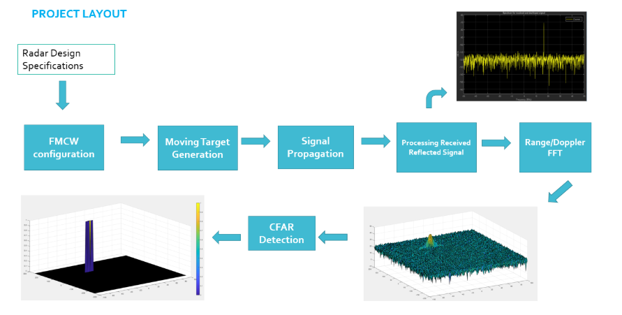
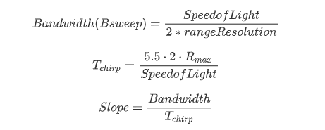
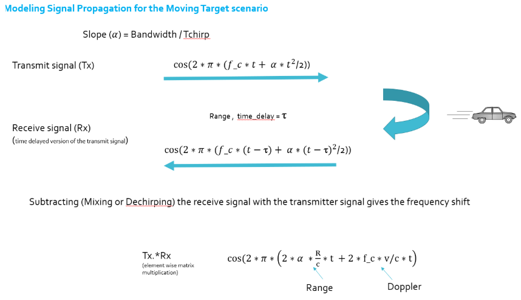
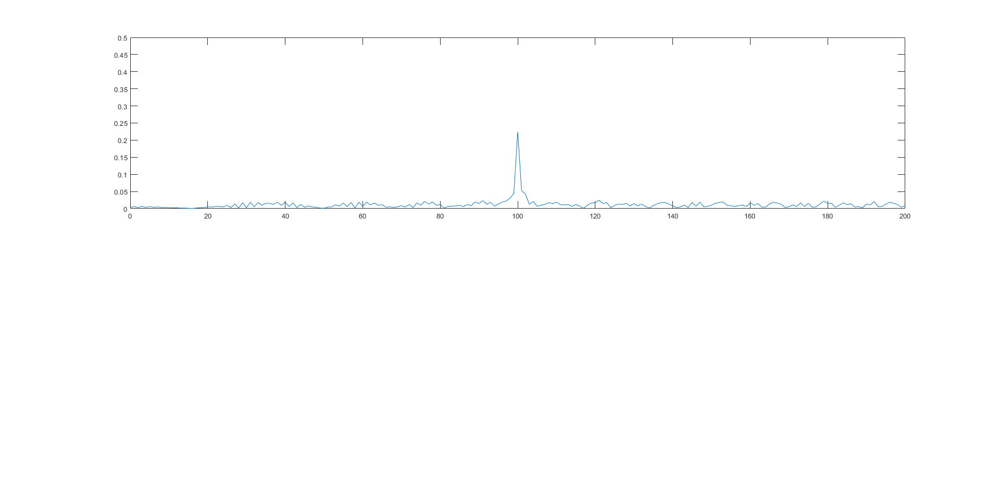
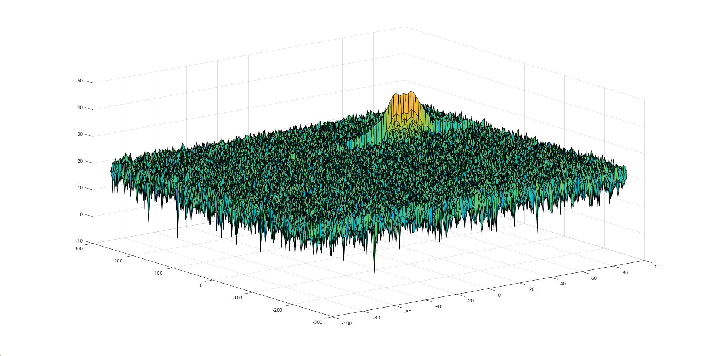
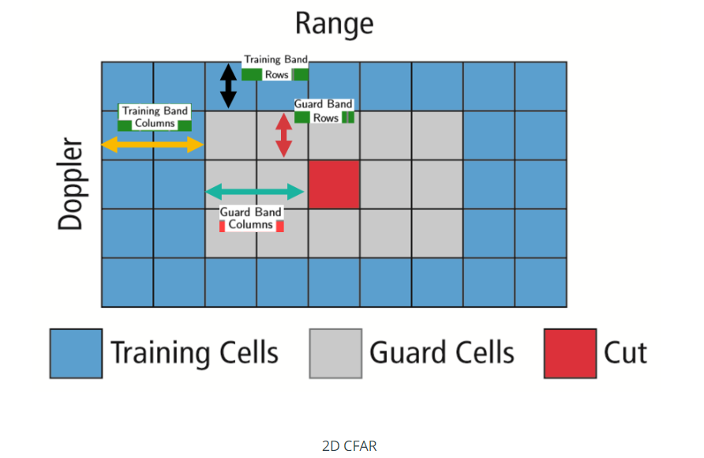
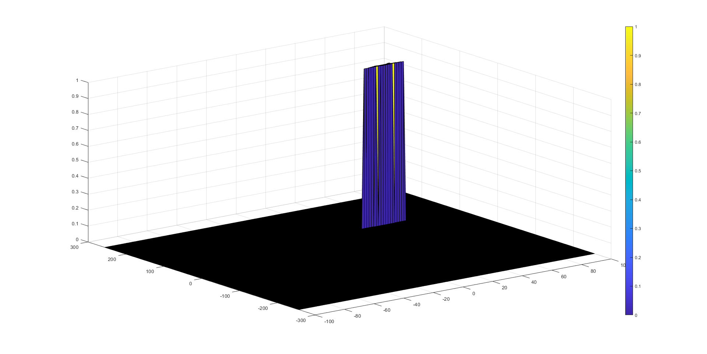

# Radar Target Generation and Detection Project

## Implementation Steps for the 2D CFAR process



There are Five major steps:

- Configure the FMCW waveform based on the system requirements.
- Define the range and velocity of target and simulate its displacement.
- For the same simulation loop process the transmit and receive signal to determine the beat signal
- Perform Range FFT on the received signal to determine the Range
- Towards the end, perform the CFAR processing on the output of 2nd FFT to display the target.

## Radar System Generation:

The default sys requirements:

| Parameters          | Values |
| ------------------- | ------ |
| Frequency           | 77GHz  |
| Range Resolution    | 1m     |
| Max Range           | 200m   |
| Max Velocity        | 70 m/s |
| Velocity Resolution | 3 m/s  |

The speed of the target and the position of the target was set to 

```
targetSpeed = 50; %target speed in m/s
targetPosition = 100; %target position in m
```

Base on the above table, we can get the sweep bandwidth, sweep time and the chirp signal slope:



The target can be detected base on the time travel of the signal:



The beat signal can be calculated by multiplying the Transmit signal Tx with Receive signal Rx. This process in turn works as frequency subtraction. It is implemented by element by element multiplication of transmit and receive signal matrices. After getting the beat signal, we can use FFT to find the position of the target and 2D FFT to find the speed of the target.

## FFT Result:

The 1st FFT output for the target located at 100 meters:



2D FFT output - Range Doppler Map:




## Training, Guard cells and offset selection

base on the size and the shape of the peak, I choose the following parameters -



| Band | Size |
| ---- | ---- |
| Tr   | 10   |
| Td   | 8    |
| Gr   | 4    |
| Gd   | 5    |

Offset = 7 in pow.

## 2D CFAR Operation:

- Determine the number of Training cells for each dimension Tr and Td. Similarly, pick the number of guard cells Gr and Gd.
- Slide the Cell Under Test (CUT) across the complete cell matrix
- Select the grid that includes the training, guard and test cells. Grid Size = (2Tr+2Gr+1)(2Td+2Gd+1).
- The total number of cells in the guard region and cell under test. (2Gr+1)(2Gd+1).
- This gives the Training Cells : (2Tr+2Gr+1)(2Td+2Gd+1) - (2Gr+1)(2Gd+1)
- Measure and average the noise across all the training cells. This gives the threshold
- Add the offset (if in signal strength in dB) to the threshold to keep the false alarm to the minimum.
- Determine the signal level at the Cell Under Test.
- If the CUT signal level is greater than the Threshold, assign a value of 1, else equate it to zero.
- Since the cell under test are not located at the edges, due to the training cells occupying the edges, we suppress the edges to zero. Any cell value that is neither 1 nor a 0, assign it a zero.

```
T = (2*Tr+2*Gr+1)*(2*Td+2*Gd+1)-(2*Gr+1)*(2*Gd+1); % training cell size
for i = (Gr+Tr+1):(Nr/2-(Gr+Tr))
    for j = (Gd+Td+1):(Nd-(Gd+Td))
        % sum up the training cells
        noise_level(1) = sum(db2pow(RDM(i-(Gr+Tr):i+(Gr+Tr),j-(Gd+Td):j+(Gd+Td))),"all");
        noise_level(2) = sum(db2pow(RDM(i-Gr:i+Gr,j-Gr:j+Gr)),"all");
        noise = noise_level(1) - noise_level(2);
        threshold = pow2db(noise*offset/T); % convert the noise to db
        CUT = RDM(i,j); % CUT(Cell under Test)
        % check if the test cell is noise
        if CUT < threshold
            RDM(i,j) = 0;
        else
            RDM(i,j) = 1;
        end
    end
end
```


## Non-threshold Cells Suppression:

The process above will generate a thresholded block, which is smaller than the Range Doppler Map as the CUTs cannot be located at the edges of the matrix due to the presence of Target and Guard cells. Hence, those cells will not be thresholded.

- To keep the map size same as it was before CFAR, equate all the non-thresholded cells to 0.

```
RDM(1:(Tr+Gr), :) = 0; % set the top margin to zero
RDM(end-Tr-Gr:end, :) = 0; % set the bottom margin to zero
RDM(:, 1:(Td+Gd)) = 0; % set the left margin to zero
RDM(:, end-Td-Gd:end) = 0; %set the right margin to zero
```

Result Image:



## Reference:

[]: https://www.radartutorial.eu/01.basics/False%20Alarm%20Rate.en.html	" radartutorial.eu"

